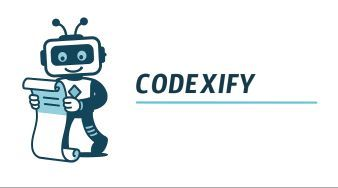

# Codexify 📜 **Transform your codebases into intelligent, structured context, perfectly optimized for Large Language Models (LLMs).**

<p align="center">

</p>

Codexify is a powerful and flexible Python tool, available as both a Command Line Interface (CLI) and an importable module. It's designed to analyze complex project trees, intelligently filter files, and aggregate their relevant content into a single text output. This output is ideal for providing rich, organized context to LLMs, significantly enhancing their ability to understand, analyze, or generate code.

---

## Table of Contents

- [Codexify 📜 **Transform your codebases into intelligent, structured context, perfectly optimized for Large Language Models (LLMs).**](#codexify--transform-your-codebases-into-intelligent-structured-context-perfectly-optimized-for-large-language-models-llms)
  - [Table of Contents](#table-of-contents)
  - [🌟 Key Features](#-key-features)
  - [🚀 Installation](#-installation)
    - [With pip (from PyPI)](#with-pip-from-pypi)
    - [From Source](#from-source)
  - [🛠️ CLI Usage](#️-cli-usage)
    - [Help](#help)
    - [Basic Compilation](#basic-compilation)
    - [Using `.gitignore` and Exclusions](#using-gitignore-and-exclusions)
    - [Handling Go Packages](#handling-go-packages)
    - [Saving Configuration (`--save`)](#saving-configuration---save)
    - [Using a Configuration File (`--config`)](#using-a-configuration-file---config)
    - [Output Options](#output-options)
  - [📦 Module Usage](#-module-usage)
  - [⚙️ YAML Configuration File](#️-yaml-configuration-file)
  - [🤝 Contributing](#-contributing)
  - [📜 License](#-license)

---

## 🌟 Key Features

*   **Structured Compilation:** Generates text output including a clear representation of the project tree and the content of selected files.
*   **Multi-Extension Support:** Easily specify file extensions whose content you want to include (e.g., `.py`, `.js`, `.md`, `.go`, `.java`, etc.).
*   **Go Package Integration:** Ability to locate and include the source code of specified Go packages.
*   **Intelligent Filtering:**
    *   Automatically respects rules defined in `.gitignore` files.
    *   Allows custom exclusions of directories and files.
    *   Ignores binary files by default to keep the context relevant.
    *   Automatically excludes `config.compiled.*.yaml` configuration files and the script itself (if run within the project path).
*   **Flexible Configuration:**
    *   Intuitive Command Line Interface (CLI) with numerous options.
    *   Support for YAML configuration files to manage complex scenarios and ensure reproducibility.
    *   `--save` option to generate a YAML configuration file from CLI arguments.
*   **LLM-Optimized Output:**
    *   Clear and well-structured text format.
    *   Headers and separators for enhanced readability.
    *   Explicit marking (`[Content Omitted]`) for files/directories present but whose content is not included.
*   **Token Estimation:** Calculates the token count (via `tiktoken` with `cl100k_base` encoding) of the generated output, essential for LLM context planning.
*   **Modular and Extensible:** Usable as a Python library in your own scripts and workflows.
*   **Automatic Dependency Management:** Attempts to install missing dependencies (`PyYAML`, `tiktoken`, `gitignore-parser`) on first run.

---

## 🚀 Installation

Ensure you have Python 3.8+ installed.

### With pip (from PyPI)

```bash
pip install codexify
```

### From Source

To install the latest development version:

1.  Clone the repository:
    ```bash
    git clone https://github.com/r-via/codexify.git
    cd codexify
    ```
2.  Install the package (using a virtual environment is recommended):
    *   For a standard installation:
        ```bash
        pip install .
        ```
    *   For an "editable" installation (changes in the source code are immediately available):
        ```bash
        pip install -e .
        ```

---

## 🛠️ CLI Usage

After installation, the `codexify` command will be available in your terminal. If you haven't installed the package, you can run it as a module from the root of the cloned project: `python -m codexify.cli [OPTIONS]`.

### Help

To see all available options and their descriptions:

```bash
codexify --help
```

### Basic Compilation

To compile all Python and Markdown files in a project:

```bash
codexify --path ./my_project --extensions .py .md
```
This will generate a file like `compiled.my_project.txt` in the `./my_project/` directory.

### Using `.gitignore` and Exclusions

Codexify defaults to using the `.gitignore` file found at the root of the `--path` (if a path is provided and a `.gitignore` exists there).

*   **Specify a different `.gitignore` file:**
    ```bash
    codexify --path ./my_project --extensions .txt --gitignore ./path/to/another.gitignore
    ```
*   **Exclude specific directories (in addition to `.gitignore`):**
    Directory names listed here will be excluded even if not in `.gitignore`. Their content will be marked `[Content Omitted]` in the tree.
    ```bash
    codexify --path ./my_project --extensions .py --exclude node_modules build dist .venv __pycache__
    ```
*   **Exclude specific files by name:**
    The content of these files will be omitted.
    ```bash
    codexify --path ./my_project --extensions .log .txt --exclude-files error.log temp.txt
    ```

### Handling Go Packages

To include the source code of Go packages (requires `go` to be installed and in your PATH):

```bash
codexify --path ./my_go_project --extensions .go --packages github.com/gin-gonic/gin net/http
```
The tree structure and content of `.go` files from these packages will be added to the output.

### Saving Configuration (`--save`)

To save your current CLI options to a YAML configuration file for future use:

```bash
codexify --path ./my_project --extensions .py .md --exclude .venv --save
```
This will create a file like `config.compiled.my_project.yaml` in the output directory (usually the `--path` directory). Paths within the YAML file will be relative to the YAML file's location.

*   **Customize the configuration and output file names:**
    ```bash
    codexify --path ./my_project --ext .py --save --config-name project_alpha --output report_alpha
    ```
    This will generate `config.compiled.project_alpha.yaml` and `compiled.report_alpha.txt`.

### Using a Configuration File (`--config`)

Once a configuration file is created (manually or via `--save`), you can use it:

```bash
codexify --config ./my_project/config.compiled.my_project.yaml
```
All options from the YAML file will be used. CLI options provided убийc 동시에 with `--config` are generally ignored (except `--save`, which is ignored if `--config` is present).

### Output Options

*   By default, the output file is named `compiled.<parent_folder_name_of_path>.txt` and is placed in the directory specified by `--path`.
*   If `--output base_name` is used, the output file will be `compiled.base_name.txt`.
*   If `--output path/to/base_name` is used, the output file will be `path/to/compiled.base_name.txt`. The output directory is then `path/to/`.

---

## 📦 Module Usage

Codexify can be imported and used in your own Python scripts.

```python
from codexify import CompilationConfig, generate_compiled_output, __version__

print(f"Using Codexify version {__version__}")

config = CompilationConfig(
    project_path="./path/to/my_source_project",
    extensions=[".py", ".md", ".go"],
    go_packages=["github.com/example/mypackage", "example.com/another/internalpackage"],
    exclude_dirs=["node_modules", ".venv", "build"],
    exclude_files=["temp_output.log"],
    gitignore_file_path="./path/to/my_source_project/.gitignore", # Optional
    output_file_path="./path/to/my_source_project/compiled_context.txt", # If you want to write directly to a file
    additional_path_permanent_exclusions={"specific_tool_output.log"}, # Exclude a specific file in addition to defaults
    verbose=True # To see process logs
)

result = generate_compiled_output(config)

if result.success:
    print(f"Compilation successful!")
    if result.output_file_path:
        print(f"Output saved to: {result.output_file_path}")
    # print(f"Compiled text:\\n{result.compiled_text}") # Warning: can be very long
    print(f"Estimated token count: {result.token_count}")
    print(f"Files compiled: {result.files_compiled_count}")
    print(f"Files skipped (content): {result.files_skipped_count}")
else:
    print(f"Compilation failed: {result.error_message}")

```

**Main module objects:**

*   `CompilationConfig`: A dataclass to specify all compilation parameters.
*   `CompilationResult`: A dataclass containing the result of the operation (success, text, stats, etc.).
*   `generate_compiled_output(config: CompilationConfig) -> CompilationResult`: The main function to perform the compilation.

---

## ⚙️ YAML Configuration File

A configuration file (e.g., `config.compiled.myproject.yaml`) can contain the following keys:

```yaml
# Path to the root directory of the project to analyze.
# Relative to the location of this YAML file.
path: "." # or "../another_project"

# List of file extensions whose content should be included.
extensions:
  - ".py"
  - ".md"
  - ".go"

# (Optional) Base name for the output file (without "compiled." prefix and .txt extension).
# The output file will be placed in the same directory as this YAML file
# if 'path' is '.', otherwise in the 'path' directory.
output: "myproject_context" # Will result in compiled.myproject_context.txt

# (Optional) List of Go packages to include.
packages:
  - "github.com/sirupsen/logrus"
  - "mymodule/internal/utils"

# (Optional) List of directory names to exclude from content compilation.
# The tree structure will show them as [Content Omitted].
exclude:
  - "node_modules"
  - ".venv"
  - "__pycache__"
  - "dist"

# (Optional) List of file names to exclude from content compilation.
exclude_files:
  - "specific_debug.log"
  - ".DS_Store"

# (Optional) Path to a .gitignore file to use for filtering.
# Relative to the location of this YAML file.
gitignore: ".customignore" # or ".gitignore"
```

---

## 🤝 Contributing

Contributions are welcome! If you have ideas for improvements, bug reports, or features you'd like to add:

1.  Please open an "Issue" first to discuss the change you wish to make.
2.  Fork the repository (`git fork https://github.com/YOUR_USERNAME/codexify.git YOUR_FORK`).
3.  Create your feature branch (`git checkout -b feature/NewFeature`).
4.  Commit your changes (`git commit -am 'Add NewFeature'`).
5.  Push to the branch (`git push origin feature/NewFeature`).
6.  Open a "Pull Request".

Please remember to add tests for your new features!

---

## 📜 License

This project is licensed under the MIT License. See the [LICENSE](LICENSE) file for details.

---

*Codexify - Let your code speak to LLMs!*